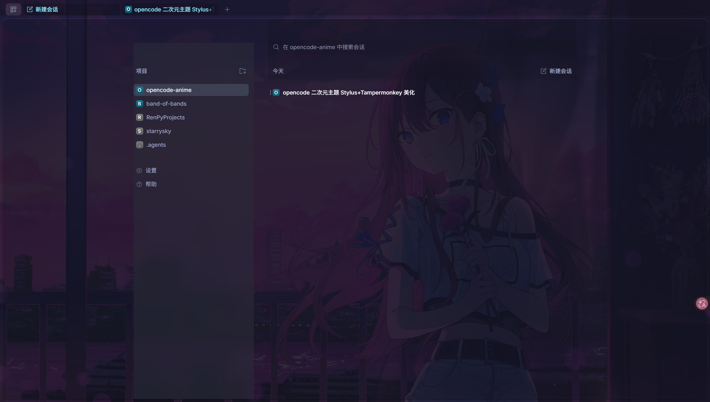
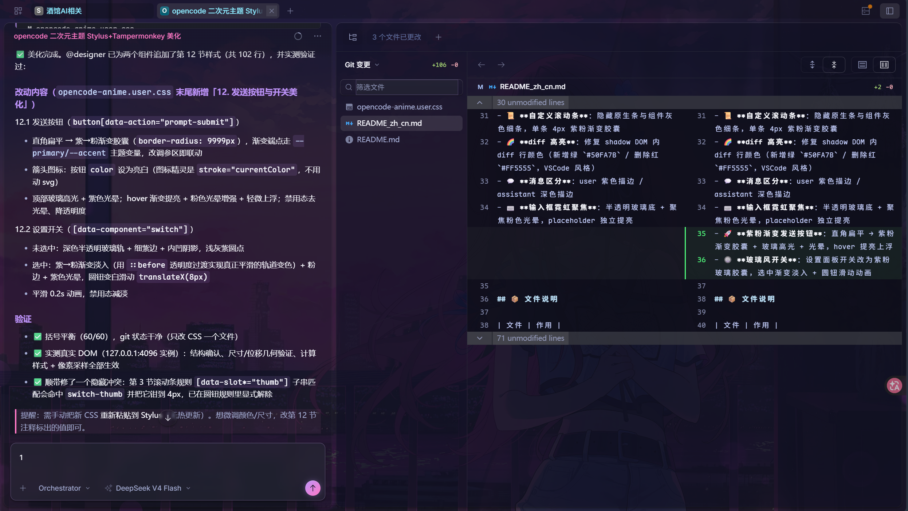
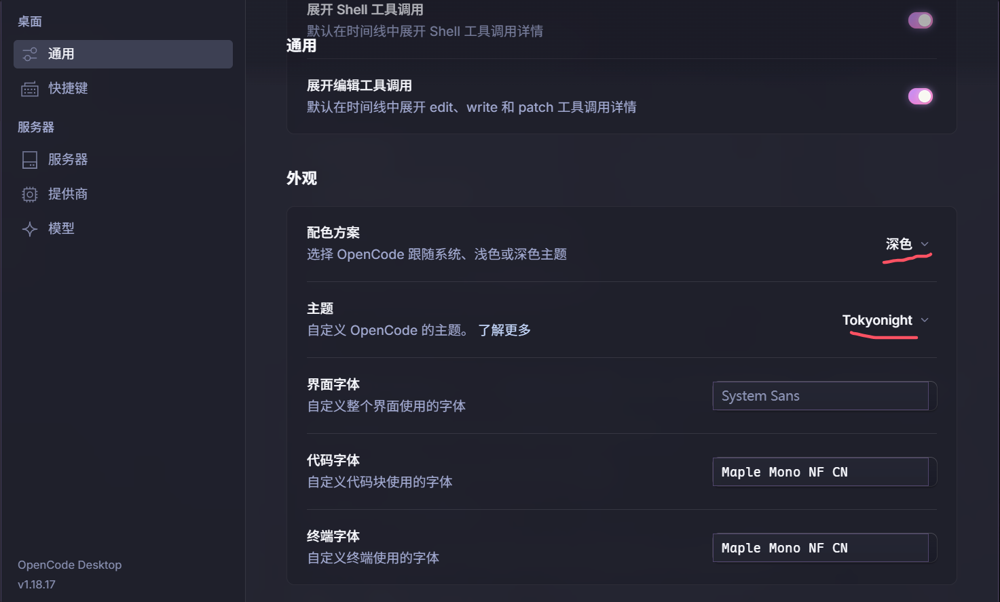
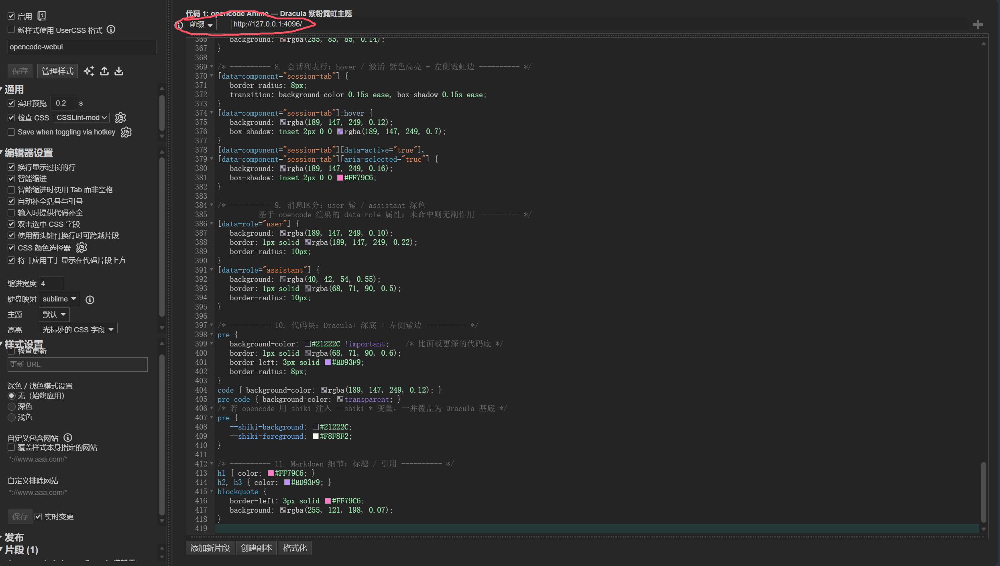

# opencode-anime

> ⚠️ **Scope**: this project only beautifies the Web UI started via the `opencode web` command; it does not apply to the terminal CLI or other usage modes.
>
> A self-use anime theme for the opencode Web UI — **Dracula purple/pink neon palette + random anime wallpaper background**.

Pure CSS skin injected via Stylus, paired with a Tampermonkey script that appends a fresh timestamp to the background URL so every page load gets a new image. It only overrides CSS variables and stable `data-*` attributes — **no layout changes, no hidden UI elements**.

**English** | [中文](./README_zh_cn.md)

## 📸 Preview

  
  

## ✨ Features

- 🎨 **Dracula purple/pink neon palette**: primary purple `#BD93F9`, accent pink `#FF79C6`, status colors from the official Dracula palette
- 🖼️ **Random anime background**: sourced from [t.alcy.cc](https://t.alcy.cc/pc/); the script appends a timestamp to bypass the 30-day cache — **a new image on every refresh**
- 🧊 **Glassmorphism**: unified `blur(14px) + saturate(1.2)` on sidebar / overlays / dialogs / menus
- 📜 **Custom scrollbars**: native and component grey bars hidden, replaced by a single 4px purple-pink gradient capsule
- 🌈 **Diff highlighting**: fixed diff-line colors inside shadow DOM (added green `#50FA7B` / removed red `#FF5555`, VS Code style)
- 💬 **Message distinction**: user messages with purple outline / assistant with dark outline
- ⌨️ **Neon input focus**: semi-transparent glass base + pink glow on focus, placeholder brightened separately
- 🚀 **Purple-pink gradient send button**: flat right angle → gradient capsule with glass highlight and glow, brightens and lifts on hover
- 🔘 **Glassmorphism toggle switch**: settings switches restyled as purple-pink glass capsules, gradient fades in when checked with a sliding thumb animation

## 📦 Files

| File | Purpose |
|------|---------|
| `opencode-anime.user.css` | Stylus theme stylesheet (pure CSS, no UserCSS header) |
| `opencode-anime-bg.user.js` | Tampermonkey script: appends timestamp to the background URL to bust the cache |

## 🍜 Getting Started

> Prerequisite: opencode Web UI running locally (e.g. `http://127.0.0.1:port`), and a browser with extension support (Chrome / Edge / Firefox).
>
> **Important: this theme is built on dark mode + the official TokyoNight theme. Please switch opencode to the official TokyoNight theme and enable dark mode in settings first**, otherwise the styles may look off.

  

### Step 1: Install the Stylus theme

1. Install the [Stylus](https://chromewebstore.google.com/detail/stylus/clngdbkpkpeebahjckkjfobafhncgmne) browser extension;
2. Click the extension icon → **Manage** → **Write new style**;
3. Paste the **entire content** of [`opencode-anime.user.css`](opencode-anime.user.css) into the editor and save;
4. In the style settings page, set the URL prefix at the top of the code editor (**change the port to your own** — e.g. if opencode runs on port 8765, use `http://127.0.0.1:8765/*`):
   - `http://127.0.0.1:your-port/*`
   - `http://localhost:your-port/*`

   

     
   

5. Refresh the opencode page — the theme is now active.

> [!IMPORTANT]
> This file is **pure CSS with no UserCSS header** (`==UserStyle==`). When Stylus injects a file containing `@match`, browsers treat `@match` as an invalid at-rule and **swallow the entire variable block**, breaking the theme. So matching must be configured via the UI's "Applies to" field — do not manually add `@match`.

### Step 2: Install the random background script (strongly recommended)

> The image API responds with `Cache-Control: max-age=2592000` (30-day cache). Without the script the background still works, but the image won't change for 30 days.

1. Install the [Tampermonkey](https://www.tampermonkey.net/) browser extension;
2. Click the extension icon → **Create a new script**, replace everything with the content of [`opencode-anime-bg.user.js`](opencode-anime-bg.user.js), and save;
3. Open the script editor and change the port in `@match` to **your own opencode port** (the default is `http://127.0.0.1:*/*`, matching any port; if your opencode runs on a specific port, e.g. 8765, change it to `http://127.0.0.1:8765/*`), save, and make sure the script is **enabled**;
4. Refresh the opencode page.

### Done 🎉

After refreshing you should see: Dracula purple/pink palette + a random anime wallpaper + glassmorphism sidebar. Every refresh swaps in a new background.

## ⚙️ Configuration

All tunable parameters live in the `--anime-*` variables at the top of the CSS `html[data-theme]` block:

| Variable | Default | Description |
|----------|---------|-------------|
| `--anime-bg-opacity` | `0.55` | Background image opacity (0.50–0.60 recommended) |
| `--anime-glass-blur` | `14px` | Glassmorphism blur radius |
| `--anime-shell-alpha` | `0.32` | Content container background alpha (0.30–0.38 recommended) |
| `--anime-review-alpha` | `0.12` | Review panel stacked alpha |

Save and refresh to apply. To change the theme colors, just edit `--primary` (purple) / `--accent` (pink).

> [!NOTE]
> Every CSS change must be **re-pasted manually into Stylus** (no hot reload).

## 🖼️ Random Background API

The background image source is [https://t.alcy.cc/pc/](https://t.alcy.cc/pc/): each request returns a random anime PC wallpaper (HTTPS, satisfying opencode's `img-src https:` CSP). On every page load the script appends `?_=<timestamp>` to bypass caching. If the image fails to load, the background falls back to solid `#282A36` and the rest of the theme is unaffected.

## 📄 License

[MIT](LICENSE) © 2026 绘星tsuki

## 🤖 About This Project

This project was created with **DeepSeek V4 Flash** through **Vibe Coding** (the author provided requirements, review, and fine-tuning while the AI did the implementation). Everyone is welcome to modify, remix, and extend it freely — Issues and PRs are also appreciated! 🎉
